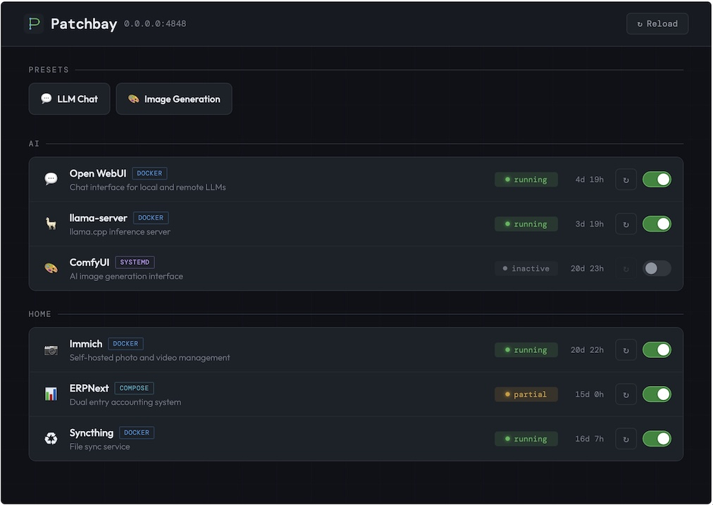

# Patchbay

A lightweight, mobile-first service control dashboard for Docker containers, Docker Compose projects, and systemd units. Toggle services on/off, restart them, and activate presets -- named configurations that orchestrate stop/start/restart sequences across multiple services.

Built for homelabs and workstations where GPU-heavy or RAM-heavy services compete for resources and can't all run simultaneously.



## Features

- Unified dashboard for Docker containers, Compose projects, and systemd units
- One-click presets that orchestrate ordered stop/start/restart sequences
- Mobile-first responsive UI (dark theme, works at 320px+)
- REST API with auto-generated OpenAPI docs at `/docs`
- HTTP health checks, Docker HEALTHCHECK integration, and status polling
- Hot-reload configuration without restarting the server

## Requirements

- Python 3.11+
- Docker (for managing Docker containers and Compose projects)
- Docker Compose v2 (for managing multi-container Compose stacks)
- systemd (for managing systemd units, Linux only)

## Quick Start

```bash
git clone https://github.com/hadsie/patchbay.git
cd patchbay
python -m venv .venv
source .venv/bin/activate
pip install .
```

Edit the YAML files in `config/`. See the `.example.yml` files for reference:

```bash
cp config/services.example.yml config/services.yml
cp config/presets.example.yml config/presets.yml
$EDITOR config/config.yml config/services.yml config/presets.yml
```

Each service in `services.yml` needs a `name`, `type`, and `target`:

```yaml
services:
  # Docker container (target = container name)
  - name: Ollama
    type: docker
    target: ollama
    description: "LLM model server"
    category: AI

  # Docker Compose project (target = path to project directory)
  - name: ERPNext
    type: compose
    target: /opt/stacks/erpnext
    description: "Full-stack ERP suite"
    url: "http://homelab.local:8069"
    health_check:
      endpoint: "http://localhost:8069/api/method/ping"

  # Systemd unit (target = unit name)
  - name: sshd
    type: systemd
    target: sshd.service
    description: "OpenSSH server daemon"
```

Optional fields: `description`, `icon` (emoji), `category` (grouping label, default `"Uncategorized"`), `url` (clickable link), `health_check` (with `endpoint`, `method`, `expected`, `timeout`, `interval`). See `services.example.yml` for full details.

Start the server:

```bash
CONFIG_DIR=./config .venv/bin/patchbay
```

Open the dashboard at http://localhost:4848 and the API docs at http://localhost:4848/docs.

### Updating

```bash
git pull
.venv/bin/pip install .
sudo systemctl restart patchbay  # if running as a service
```

### Configuration reload

Config can also be reloaded without restarting:

```bash
curl -X POST http://localhost:4848/api/config/reload
```

## API

All endpoints return JSON. The web UI uses these same endpoints.

```bash
# List all services with current state and health
curl http://localhost:4848/api/services

# Get a single service
curl http://localhost:4848/api/services/llama-server

# Start / stop / restart
curl -X POST http://localhost:4848/api/services/llama-server/start
curl -X POST http://localhost:4848/api/services/llama-server/stop
curl -X POST http://localhost:4848/api/services/llama-server/restart

# List presets
curl http://localhost:4848/api/presets

# Activate a preset (runs actions sequentially)
curl -X POST http://localhost:4848/api/presets/LLM%20Chat/activate

# Health / config / reload
curl http://localhost:4848/api/health
curl http://localhost:4848/api/config
curl -X POST http://localhost:4848/api/config/reload
```

Full interactive API documentation is available at http://localhost:4848/docs (Swagger UI).

## Health Checking

Patchbay resolves service health using a priority chain:

1. **Stopped/inactive** -- health is `"n/a"`
2. **HTTP health check** configured in `services.yml` -- uses the check result
3. **Docker HEALTHCHECK** defined in the container's Dockerfile/compose -- uses Docker's built-in health status
4. **Running with no check configured** -- assumes `"healthy"`
5. **Partial** (compose only, some containers down) -- `"unhealthy"` unless an HTTP check overrides

HTTP health checks run in the background at the configured interval and only target services that are currently running.

## Authentication

Patchbay supports role-based access control through forward authentication headers set by a reverse proxy. When enabled, you can control which roles can view or control each service and preset. Auth is disabled by default.

See [docs/AUTH.md](docs/AUTH.md) for configuration and setup instructions.

## Deployment

### Docker

The included `compose.yml` mounts the Docker socket and the `config/` directory into the container:

```bash
docker compose up -d --build
```

Your mounted `config/config.yml` must set `host: "0.0.0.0"` so the server is reachable from outside the container. The default (`127.0.0.1`) only listens on the container's loopback and won't be accessible on the mapped port.

When running in Docker, Patchbay can manage Docker containers and Compose projects but not systemd units. For systemd unit management, run Patchbay directly on the host.

### Direct install (Docker + Compose + systemd)

To manage Docker containers, Compose projects, and systemd units, run directly on the host.

Create a dedicated user and give it Docker access:

```bash
sudo useradd -r -s /usr/sbin/nologin patchbay
sudo usermod -aG docker patchbay
```

If you only need Docker management, that's sufficient. To also manage systemd units, create a sudoers rule that allows the patchbay user to run `systemctl start`, `stop`, and `restart` without a password:

```bash
sudo visudo -f /etc/sudoers.d/patchbay
```

```
patchbay ALL=(ALL) NOPASSWD: /usr/bin/systemctl start *, /usr/bin/systemctl stop *, /usr/bin/systemctl restart *
```

Clone the repo and install:

```bash
sudo git clone https://github.com/hadsie/patchbay.git /opt/patchbay
cd /opt/patchbay
sudo python -m venv .venv
sudo .venv/bin/pip install .
sudo chown -R patchbay:patchbay /opt/patchbay
```

Create the systemd service:

```ini
# /etc/systemd/system/patchbay.service
[Unit]
Description=Patchbay Service Dashboard
After=network.target docker.service

[Service]
Type=simple
Environment=CONFIG_DIR=/opt/patchbay/config
ExecStart=/opt/patchbay/.venv/bin/patchbay
WorkingDirectory=/opt/patchbay
Restart=always
User=patchbay

[Install]
WantedBy=multi-user.target
```

```bash
sudo systemctl daemon-reload
sudo systemctl enable --now patchbay
```

### Docker socket security

Mounting the Docker socket grants full control over all containers. For hardened deployments, consider using [docker-socket-proxy](https://github.com/Tecnativa/docker-socket-proxy) to whitelist only the API endpoints Patchbay needs (container inspect, start, stop, restart).

## Development

```bash
pip install -e ".[dev]"

# Dev server with auto-reload
CONFIG_DIR=./config uvicorn patchbay.main:app --reload --port 4848

# Tests
pytest

# Lint and format
ruff check .
ruff format .
```
